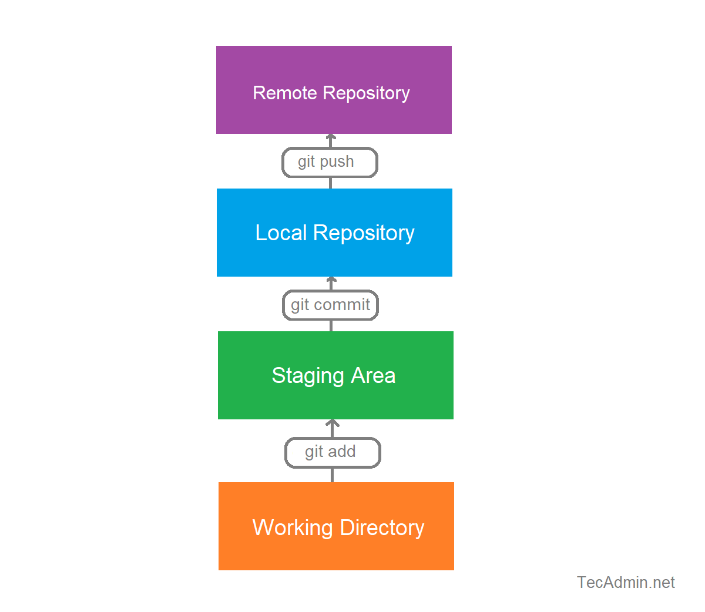

# The basic Git Workflow

This document covers all commands of a basic Git workflow, that we have learned in class, so far. It also contains a few additional explanations about the commands for a better understanding.

## Overview of Commands

The synthax to use a command is:
```console
git <command>
```
For further information, just click on a command.
| Command | Explanation |
| :------ | :---------: |
| **[add](https://git-scm.com/docs/git-add) .** | add the whole content of the directory to the staging area |
| **[add](https://git-scm.com/docs/git-add) \<filename\>** | add a certain file to the staging area |
| **[diff](https://git-scm.com/docs/git-diff)** | view the changes that COULD be added next to the staging area, but haven't been so far | 
| **[diff](https://git-scm.com/docs/git-diff) --cached** | view the changes that are staged for the next commit relative to **HEAD** <br> (**staged** is a synonym for **cached**) |
| **[status](https://git-scm.com/docs/git-status)** | view the state of the working directory and the staging are<br>(which changes have been staged, which haven't,<br> and which files aren't being tracked by Git) |
|  **[commit](https://git-scm.com/docs/git-commit) -m "short, but meaningfull comment"**| transer the changes to the local repository |
| **[log](https://git-scm.com/docs/git-log)** | show the commit history |
| **[log](https://git-scm.com/docs/git-log) --pretty=oneline** | easier to read commit history, because every commit is on 1 line |
| **[push](https://git-scm.com/docs/git-push)** | upload the changes to the remote repository |

## Overview of a basic Git Workflow


