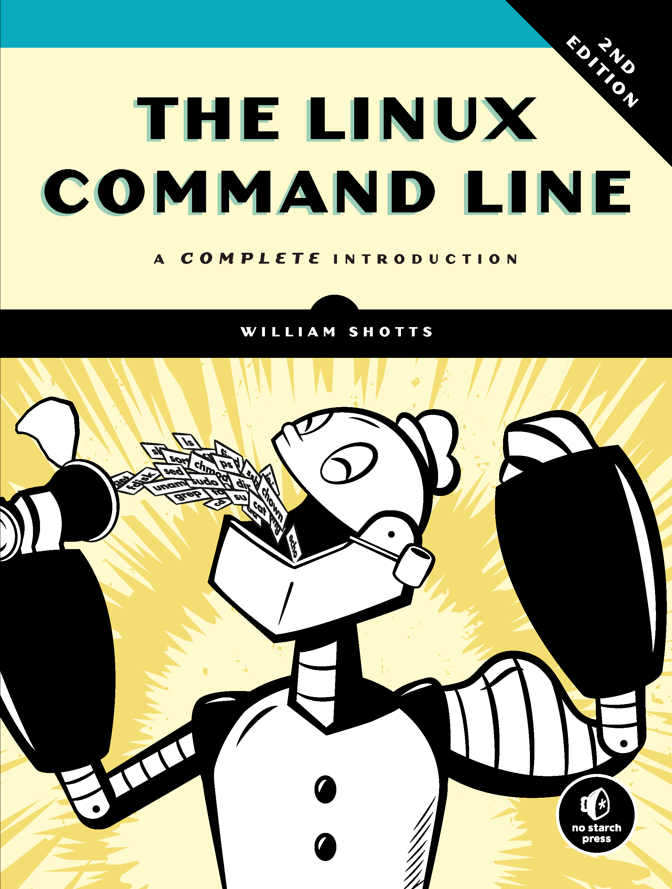

# Introduction to  Linux Commands

Linux is a free and open source operating system, which comprises a graphical user interface as well as a terminal - also called bash - for controlling the system using typed commands. These written commands are also known as linux commands. THey are a very powerful tool for controlling the operating system.

## Opening the Terminal

The terminal can usually be found in the app store of the linux distribution of your choice. Alternatively, the terminal can usually be opened using the following command:

**cntr - alt - T**

## Navigating using the terminal

Before navigating through the folders - called directories - in your linux operating system, one must determine where the terminal was opened.

### Where am I?

Use the command pwd (Print working directory) in order to find out in which folder you are.

**pwd**

The response should be similar to this:

**/home/dci-student**

**/** is the root folder. THis means that all folders are subfolders of the root or nested into the root. If you think of the folders as a tree structure then / represents the trunk of the tree.

### What is here?

After finding your location within the linux folder structure, you probably want to know what you can find in the current folder. This is achieved using the following command:

**ls**

ls stands for list. The response to this command must be something like this:

**branching  E04-repo-  EO4-fork  first_project  markdown  readme.txt**

Both the folders and files are displayed in response to the ls command. In this example, the only file is called readme.txt. The residual content of the folder are subfolders. 

### Help me?

At this point in time you probably want to explore more options of the list command. In order to get explanations for any command you may use the man (manual) commmand:

**man command**

All the options for using the particular command are displayed to you. Press q to exit the manual.

### Navigating to a Subfolder

Use the cd command in order to nagivate to subfolder with the following syntax:

**cd subfolder_name**

### Navigating to a Superfolder

Use the following command in oder to  move down the tree in the direction of the trunk.

**cd ..**

In response, you will be directed to a superfolder of the current folder. The current folder will be displayed as a subfolder in response to pwd (print working directory).

### Navigating to an arbitrary folder

If you know the location you want to go to but do not want to navigate through the directory tree stucture then you can use the following short cut:

**cd /directory1/directory2/.../**

The terminal will be directly directed to the specified folder.

## Creating Files

Once you have navigated into a particular folder of your liking, you will probably want to create a file. Use the following command:

**touch file_name.extension**

Every file has a filename extension. This extensions tells the operating system, what kind of file you have created. For example, in order to create a simple text file you may use the extension .txt

**touch readme.txt**

The abouve command creats a text file called readme.txt in the current directory. The file name will be displayed when listing the content of the current folder using the ls command (list).

## Removing files

Use the remove command "rm" in order to remove any file within the current directory.

**rm file_name.extension**

## Finding more detailed explanations about the terminal

A comprehensive introduction to the linux command line is the book ["The Linux command line" by William E. Schotts, Jr.](https://www.amazon.de/-/en/William-Shotts/dp/1593279523)

